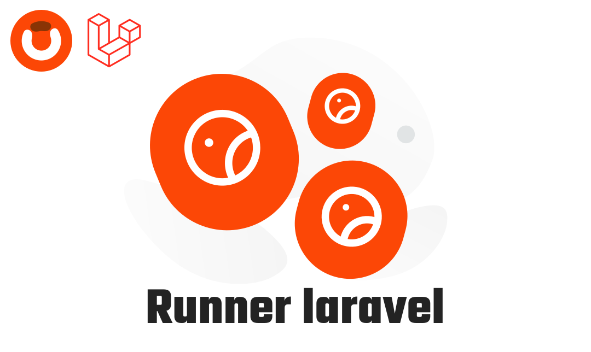

  
  

# Runner Laravel

A powerful Laravel package for managing and executing scheduled tasks with priority-based execution, tagging, and flexible scheduling capabilities.

## Features

- **Priority-based Execution**: Control the order of runner execution with customizable priorities
- **Flexible Scheduling**: Schedule runners to run at specific times using cron-like expressions
- **Tagging System**: Organize and filter runners by tags for better organization
- **Execution Types**: Support for both one-time (`once`) and recurring (`always`) runners
- **Lifecycle Hooks**: Built-in `before()` and `after()` hooks for pre/post-execution logic
- **Execution Tracking**: Track runner executions and prevent duplicate runs
- **Artisan Commands**: Full CLI support for creating, listing, and running runners
- **Runner Pools**: Organize runners into different pools with custom paths

## Documentation

You can find the detailed documentation here in [Documentation](https://devdocs.obelaw.com/packages/runner-laravel).

## Contributing

Thank you for considering contributing to this package! Be one of the Obelaw team.

## License

This package is an open-sourced software licensed under the [MIT license](https://opensource.org/licenses/MIT).
